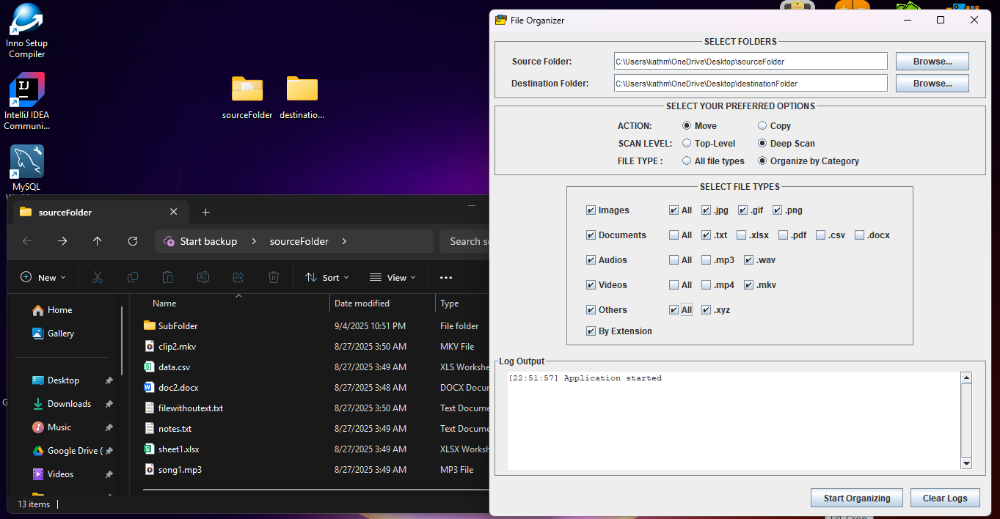
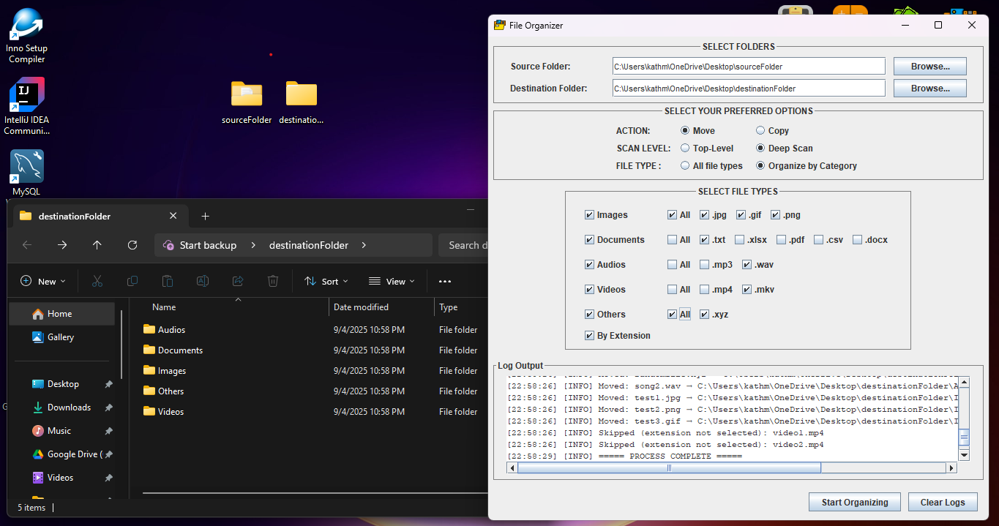
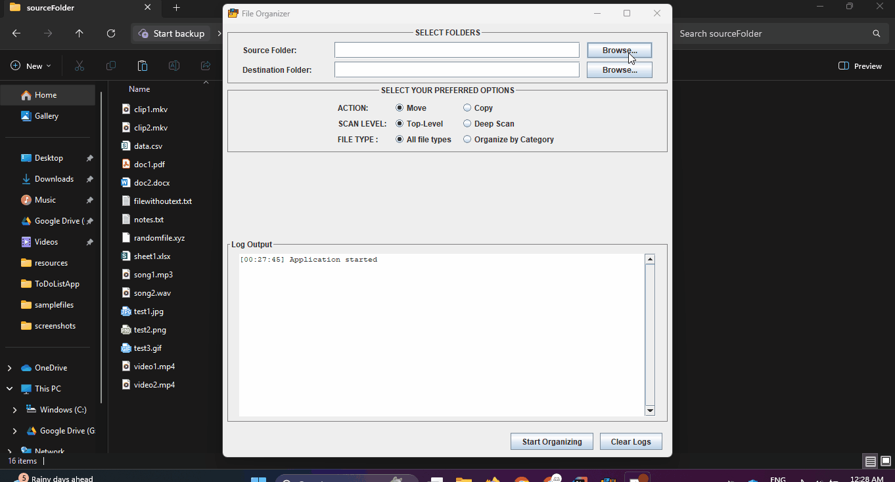

# 📂 File Organizer App

## 📝 Overview
The **File Organizer App** is a Java desktop application that automatically organizes files in a directory.

This project demonstrates **Java File I/O, OOP principles, and GUI development**.

---

## 🚀 Features
- **Flexible organization options**:
    - **Action:** Move or Copy files
    - **Scan Level:** Top-Level only or Deep Scan (include subfolders)
    - **File Type:** All files or Organize by Category
- **Smart categorization** into:
    - Images (`.jpg`, `.png`, `.gif`)
    - Documents (`.pdf`, `.docx`, `.txt`)
    - Audio (`.mp3`, `.wav`)
    - Video (`.mp4`, `.avi`)
    - Others (uncategorized file types)
- **Dynamic GUI updates**:
    - File extensions are automatically populated after scanning the source folder.
    - Users can select specific extensions to organize.
- **Duplicate file handling**:
    - Option to overwrite existing files or keep both.
- **Lightweight and easy to use** with a clean interface.

---

## 🛠️ Tech Stack
- **Language:** Java (JDK 17)
- **IDE:** IntelliJ IDEA
- **Libraries:** Standard Java I/O (`java.io.File`, `java.nio.file.*`)
- **GUI:** Swing

---

## 📂 Project Structure
```
FileOrganizer/
├── src/                 # Java source code
├── resources/           # App resources 
├── samplefiles/         # Example files for testing
├── FileOrganizer.iss    # Installer script
├── .gitignore
└── README.md
```

---

## 📸 Screenshots

Here are some screenshots of the File Organizer App in action:

*➡️ Main window before scanning*


*➡️ Organized results after scanning*

---

## 🎬 Demo

Here’s a quick demo of the File Organizer App in action:


---

## 🔮 Future Improvements
- Progress bar for large directories
- Option to move specific extensions to preferred categories
- Option to create subfolders for selected extensions
- Drag-and-drop file support

## 👤 Author
- **Kathlene Manaloto**
- [GitHub](https://github.com/KathManaloto)
- [LinkedIn](https://www.linkedin.com/in/kathlene-manaloto/)  